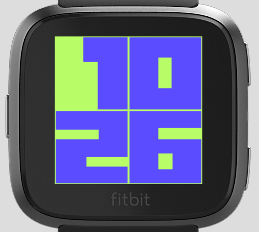

# Big-Time-Fitbit
Clock face for Fitbit Versa and Ionic that makes use of large fonts. Port of a similar face I built for the Pebble - https://github.com/wedwabbit/Big-Time-DateColour.

Features include:
1. Choice of fonts (only two at the moment).
2. Choice of background and foreground (digit) colours.
3. Tap display date (date on top line, month on bottom line).
4. Choice of timeout for date display (1, 2, or 5 seconds).

To do:
1. More fonts.
2. ~~Display date when on tap or button push.~~

## Examples

### Versa

### Ionic

