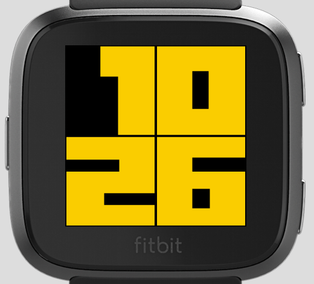

# Big-Time-Fitbit
Clock face for Fitbit Versa and Ionic that makes use of large fonts. Port of a similar face I built for the Pebble - https://github.com/wedwabbit/Big-Time-DateColour.

Options include:
1. Choice of fonts (only two at the moment).
2. Choice of background and foreground (digit) colours.

To do:
1. More fonts.
2. Display date when on tap or button push.

## Examples

### Versa

### Ionic

